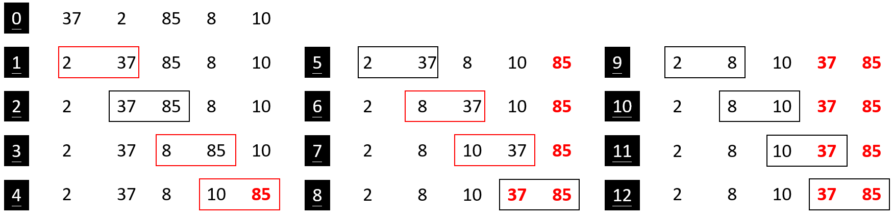
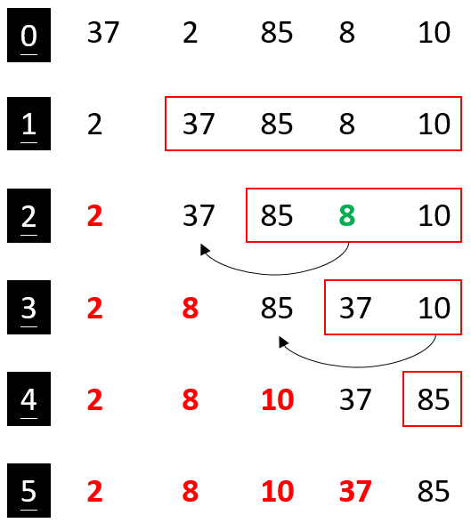
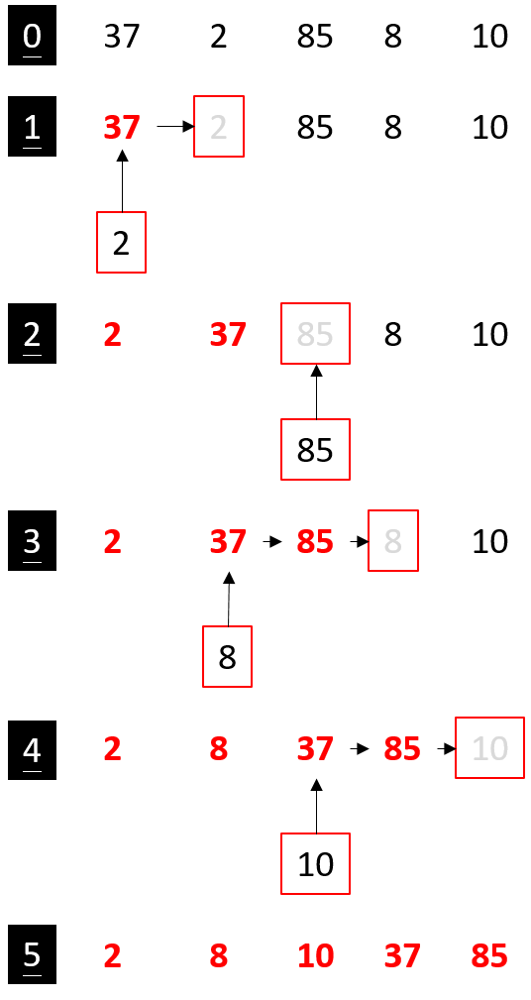
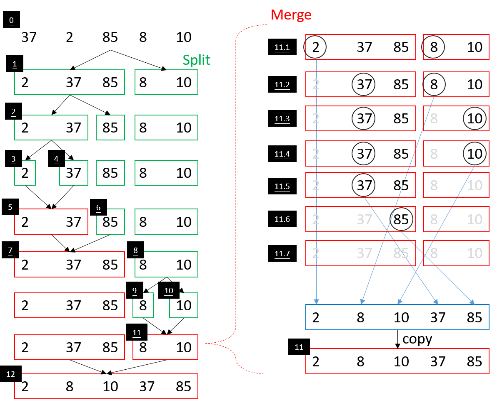

# Sort
+ [Bubble sort](#Bubble-sort)
+ [Selection sort](#Selection-sort)
+ [Insertion sort](#Insertion-sort)
+ [Merge sort](#Merge-sort)
+ [Quick sort](#Quick-sort)

## Develop tools and techniques
+ Java
+ Eclipse

## Bubble sort

  

## Selection sort

  

## Insertion sort

  

## Merge sort

  

## Quick sort

  

## Reference
[visualgo](https://visualgo.net/en/sorting)

